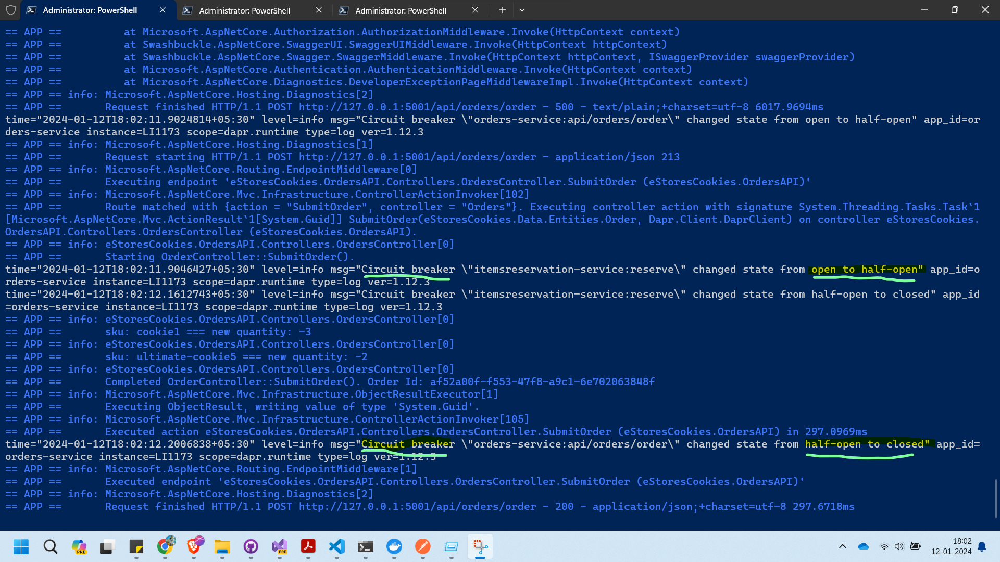

# Microservices using .NET 8, and DAPR (Service to Service Invocation)

## Date Time: 13-Jan-2024 at 12:30 AM IST

## Event URL: [https://dotnetcopilot.com/net-conf-manila-philippines-2023](https://dotnetcopilot.com/net-conf-manila-philippines-2023)

## YouTube URL: [https://www.youtube.com/watch?v=zvGDbaUfky0](https://www.youtube.com/watch?v=zvGDbaUfky0)

---

### Software/Tools

> 1. OS: Windows 10 x64
> 1. Python / .NET 7
> 1. Visual Studio 2022
> 1. Visual Studio Code

### Prior Knowledge

> 1. Programming knowledge in C# / Python
> 1. Azure

## Technology Stack

> 1. .NET 7, Azure, OpenAI

## Information

## What are we doing today?

> 1. The Big Picture
> 1. Look into DAPR (Distributed Application Runtime) from 30,000 foot
> 1. Creating two Microservices
> 1. How communication works between two services
> 1. Timeouts, Retries, and Circuit Breaker Pattern.
> 1. SUMMARY / RECAP / Q&A

### Please refer to the [**Source Code**](https://github.com/ViswanathaSwamy-PK-TechSkillz-Academy/learn-azure-openai) of today's session for more details

---

---

## The Big Picture

Dapr is an event-driven, portable runtime created by Microsoft with an open source approach and it is a Cloud Native Computing Foundation (`CNCF`) incubated project.

### Pre-requisites

> 1. Installation and Initialization of Dapr
> 1. Docker should be running

## Look into DAPR (Distributed Application Runtime) from 30,000 foot

> 1. Discussion and Demo

---

## SUMMARY / RECAP / Q&A

> 1. SUMMARY / RECAP / Q&A
> 2. Any open queries, I will get back through meetup chat/twitter.

---

## What is Next? session?

> 1. To be decided
