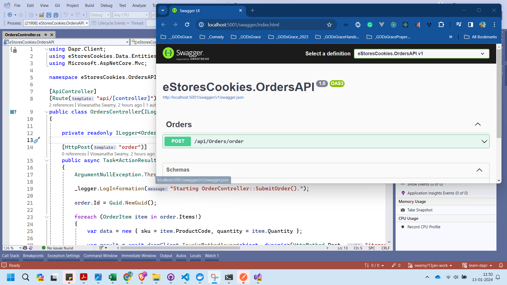
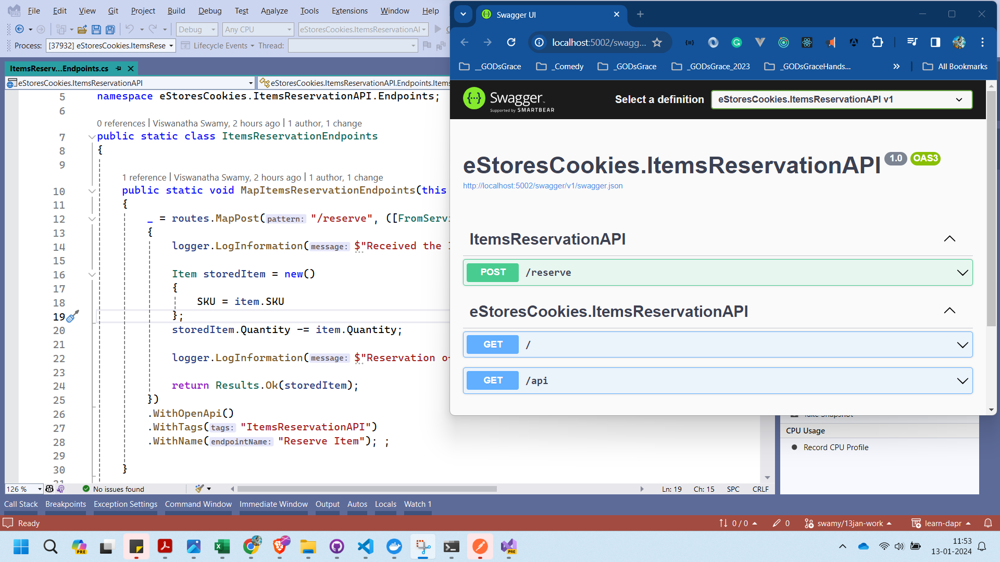
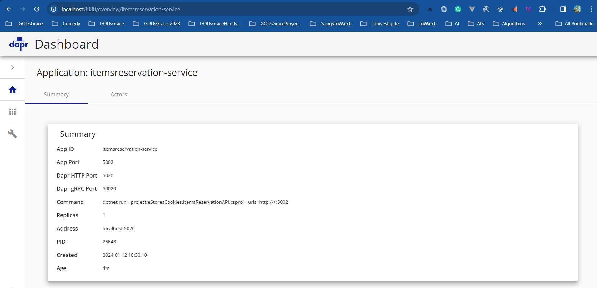
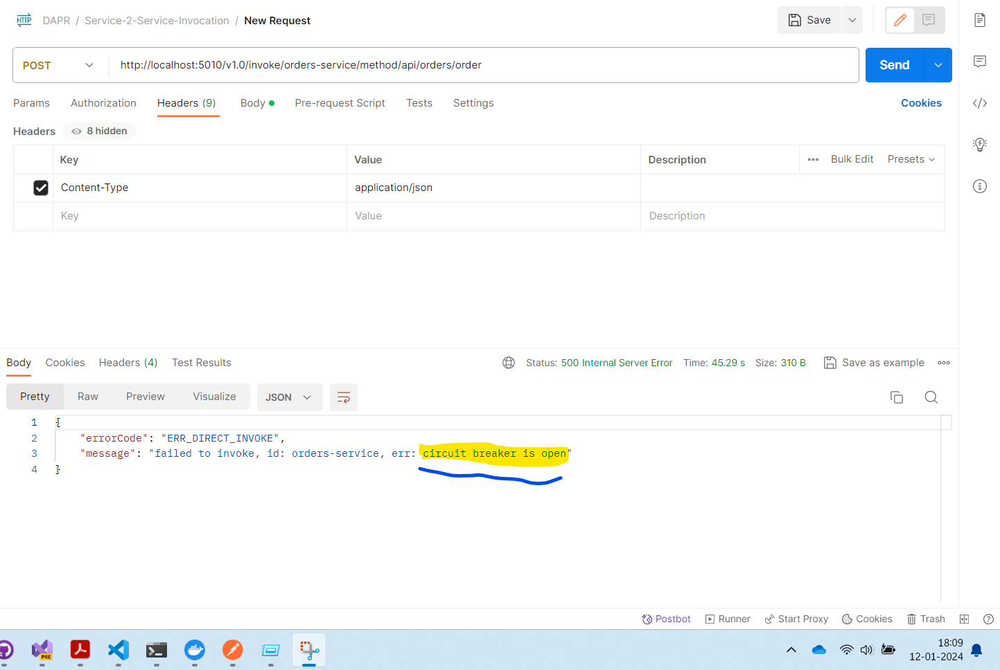

# Microservices using .NET 8, and DAPR (Service to Service Invocation)

## Date Time: 15-Jan-2024 at 09:00 AM IST

## Event URL: [https://www.meetup.com/dot-net-learners-house-hyderabad/events/296871916](https://www.meetup.com/dot-net-learners-house-hyderabad/events/296871916)

## YouTube URL: [https://www.youtube.com/watch?v=ToBeDone](https://www.youtube.com/watch?v=ToBeDone)

---

### Software/Tools

> 1. OS: Windows 10/11 x64
> 1. Python / .NET 8
> 1. Visual Studio 2022
> 1. Visual Studio Code

### Prior Knowledge

> 1. Programming knowledge in C# / Python
> 1. Azure

## Technology Stack

> 1. .NET 8, DAPR

## Information

## What are we doing today?

> 1. The Big Picture
> 1. DAPR (Distributed Application Runtime) from 30,000 foot
> 1. Creating two Microservices
> 1. How communication works between two services
>    - Name Resolution
> 1. Resiliency
>    - Timeouts, Retries, and Circuit Breakers
> 1. SUMMARY / RECAP / Q&A

### Please refer to the [**Source Code**](https://github.com/ViswanathaSwamy-PK-TechSkillz-Academy/learn-dapr) of today's session for more details

---

---

## The Big Picture

### Pre-requisites

> 1. Docker should be running
> 1. Installation and Initialization of Dapr

## DAPR (Distributed Application Runtime) from 30,000 foot

Dapr is a portable, event-driven runtime that makes it easy for any developer to build resilient, stateless, and stateful applications that run on the cloud and edge and embraces the diversity of languages and developer frameworks. It is created by Microsoft with an open source approach and it is a Cloud Native Computing Foundation (`CNCF`) incubated project.

> 1. Discussion and Demo
> 1. <https://docs.dapr.io/concepts/overview/>

---

## Creating two Microservices

> 1. Discussion and Demo

### Orders Reservation Service

### Items Reservation Service

## How communication works between two services

> 1. Discussion and Demo

### Service to Service Invocation

> 1. <https://docs.dapr.io/developing-applications/building-blocks/service-invocation/service-invocation-overview/>
> 1. Dapr facilitates service-to-service invocation by providing a standardized and language-agnostic approach. Through the Dapr API, services can easily communicate with each other using the sidecar pattern, enabling seamless interaction between microservices. Dapr abstracts away the complexities of network communication, making it straightforward to invoke methods on remote services.

### Name Resolution

> 1. <https://docs.dapr.io/reference/components-reference/supported-name-resolution/>
> 1. Name resolution in Dapr involves the ability to dynamically discover and address services within a distributed system. Dapr supports service discovery by allowing services to be addressed using their logical names. This abstraction enhances flexibility, as the actual location or IP address of a service can change without affecting the calling service. Dapr's name resolution simplifies the development and deployment of microservices by providing a consistent and adaptable way to identify and communicate with other services.

## Resiliency

> 1. <https://docs.dapr.io/operations/resiliency/resiliency-overview/>
> 1. Resiliency in Dapr refers to the system's ability to recover gracefully from failures and maintain consistent functionality. Dapr supports resiliency by providing features like retries, timeouts, and circuit breakers, which collectively contribute to building robust and fault-tolerant distributed applications.
> 1. Dapr's resiliency features, including timeouts, retries, and circuit breakers, collectively contribute to building robust and fault-tolerant distributed systems. They help handle transient failures, set boundaries on operation durations, and prevent cascading failures across microservices.

### Timeouts

> 1. Timeouts in Dapr represent the maximum allowable duration for an operation to complete. By setting appropriate timeouts, you ensure that your application doesn't wait indefinitely for a response, preventing potential resource exhaustion and improving overall system responsiveness. Timeouts are crucial in managing the performance and reliability of distributed systems.

### Retries

> 1. Dapr supports automatic retries to handle transient failures that might occur during communication with external services. By specifying a retry policy, you can instruct Dapr to reattempt an operation if the initial attempt fails, helping to mitigate temporary issues and enhance the reliability of interactions between microservices.

### Circuit Breaker

> 1. <https://learn.microsoft.com/en-us/azure/architecture/patterns/circuit-breaker>
> 1. The circuit breaker pattern in Dapr is a mechanism to prevent continuous retries during persistent failures. It monitors the health of an external service, and if a predefined failure threshold is reached, the circuit breaker "trips," temporarily preventing further attempts. This helps to avoid overloading the failing service and allows it time to recover before resuming normal operation.

## SUMMARY / RECAP / Q&A

> 1. SUMMARY / RECAP / Q&A
> 2. Any open queries, I will get back through meetup chat/twitter.

---
