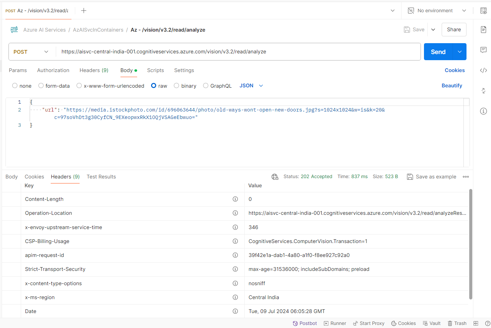
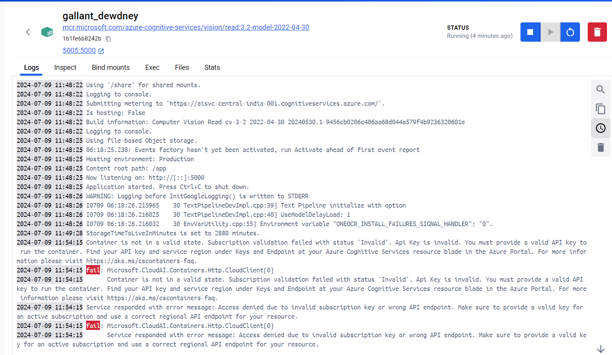
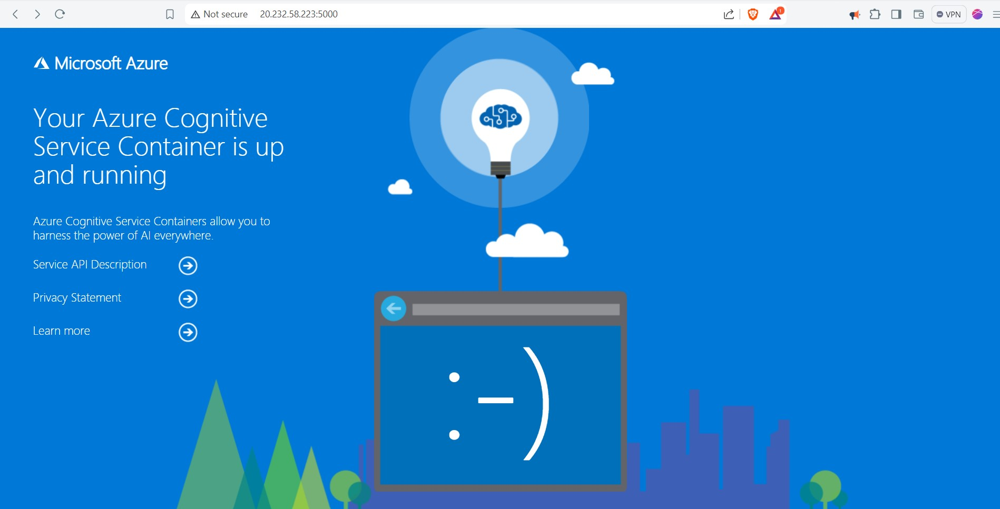
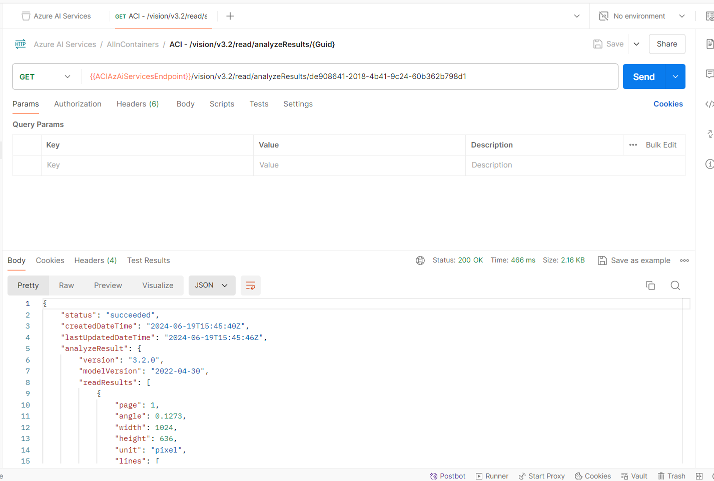
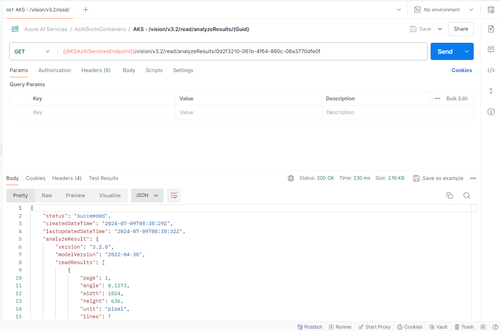

# AI 102 - Deploy Azure AI Services in Containers, ACI, and AKS

## Date Time: 09-Jul-2024 at 05:00 PM IST

## Event URL: [https://www.meetup.com/microsoft-reactor-bengaluru/events/301436944](https://www.meetup.com/microsoft-reactor-bengaluru/events/301436944)

## YouTube URL: [https://www.youtube.com/watch?v=ToBeDone](https://www.youtube.com/watch?v=ToBeDone)

## MS Learn Module(s)

> 1. <https://aka.ms/Analyzevideo>
> 1. <https://aka.ms/AIVisionService>


---

### Software/Tools

> 1. OS: Windows 10/11 x64
> 1. Python / .NET 8
> 1. Visual Studio 2022
> 1. Visual Studio Code

### Prior Knowledge

> 1. Programming knowledge in C# / Python
> 1. Microservices / Distributed applications
> 1. Azure / Azure Open AI

## Technology Stack

> 1. .NET 8, Python, Azure

## Information


## What are we doing today?

> 1. The Big Picture
>    - Pre-requisites
>    - Previous Session
>    - Current Architecture
> 1. Provision an Azure AI Services resource
>    - Retrieve the `Endpoint` and `key` from Portal
>    - Retrieve/Modify the `key` using PowerShell
> 1. Verifying the Vision Analysis using Azure Service and Postman
> 1. Understanding containers
>    - `Docker` installed Locally
> 1. Deploy Azure AI services as Local Docker containers
>    - Deploy and run a Vision container on Local Docker
>    - Verify Local Docker Container using `Browser`
>    - Verify Local Docker Container using `Postman`
>    - Regenerate the API Key and verify the docker container
> 1. Deploy Azure AI services containers on Azure Container Instance
>    - Create ACI resource, and host the AI Service container
>    - Verify Vision container on Azure Container Instance using `Browser`
>    - Verify Vision container on Azure Container Instance using `Postman`
> 1. Deploy Azure AI services containers on Azure Kubernetes Service
>    - Create Azure Kubernetes Service Cluster
>    - Deploy Vision Container inside AKS
>    - Verify Vision container inside Azure Kubernetes Cluster using `Browser`
>    - Verify Vision container on Azure Kubernetes Cluster using `Postman`
> 1. SUMMARY / RECAP / Q&A

### Please refer to the [**Source Code**](https://github.com/vishipayyallore/aiml-2024/tree/main/ai102demos) of today's session for more details

---


---

## 1. The Big Picture

> 1. Discussion on Azure AI Services in Containers

### Pre-requisites

> 1. Azure Open AI, AI/ML
> 1. Python, C#, and .NET 8

### Previous Session

> 1. `Entire playlist` <https://www.youtube.com/playlist?list=PLmsFUfdnGr3wmIh-glyiMkhHS6byEuI59>

### Current Architecture

> 1. NA

## 2. Provision an Azure AI Services resource

> 1. Discussion and Demo
> 1. Azure AI services multi-service account
> 1. Resource Group name `rg-ai102-dev-001`
> 1. Azure AI Services name `azaisvc-ai102-dev-001`

### 2.1. Retrieve the `Endpoint` and `key` from Portal

> 1. Discussion and Demo
> 1. Please place these inside your `secrets.json` which is outside your source code location, OR `appsettings.json` which is placed inside `.gitignore`
> 1. Please create an `appsettings.example.json` for reference.
> 1. Please place these inside your `.env` file.
> 1. Please create an `example.env` for reference.
> 1. Environment Variables is also another option.

### 2.2. Retrieve/Modify the `key` using PowerShell

> 1. Discussion and Demo

```powershell
$rgname="rg-ai102-dev-001"
$aaisvs="aisvc-central-india-001"

az cognitiveservices account keys list --name $aaisvs --resource-group $rgname

az cognitiveservices account keys regenerate --name $aaisvs --resource-group $rgname --key-name key1
```

## 3. Verifying the Vision Analysis using Azure Service and Postman

> 1. Discussion and Demo



## 4. Understanding containers

> 1. Discussion and Demo

### 4.1. `Docker` desktop installed Locally

> 1. Discussion and Demo

## 5. Deploy Azure AI services as `Local Docker` containers

> 1. Discussion and Demo

**Reference(s):**

> 1. <https://learn.microsoft.com/en-gb/training/modules/investigate-container-for-use-with-ai-services/1-introduction>
> 1. <https://microsoftlearning.github.io/mslearn-ai-services/Instructions/Exercises/04-use-a-container.html>
> 1. <https://learn.microsoft.com/en-us/azure/ai-services/cognitive-services-container-support>
> 1. <https://learn.microsoft.com/en-us/azure/ai-services/language-service/overview#deploy-on-premises-using-docker-containers>
> 1. <https://learn.microsoft.com/en-us/azure/ai-services/language-service/language-detection/how-to/use-containers>

### 5.1. Deploy and run a Vision container on Local Docker

> 1. Discussion and Demo

#### Pull in docker image

```powershell
docker pull mcr.microsoft.com/azure-cognitive-services/vision/read:3.2-model-2022-04-30
```


#### Running the docker image

```powershell
$ApiKey="111e11c1b111111c11111c11c1c1f11e"
$BillingEndpoint="https://YourEndpoint.cognitiveservices.azure.com/"

docker run --rm -it -p 5005:5000 --memory 16g --cpus 8 mcr.microsoft.com/azure-cognitive-services/vision/read:3.2-model-2022-04-30 Eula=accept Billing=$BillingEndpoint ApiKey=$ApiKey

docker run --rm -d -p 5005:5000 --memory 16g --cpus 8 mcr.microsoft.com/azure-cognitive-services/vision/read:3.2-model-2022-04-30 Eula=accept Billing=$BillingEndpoint ApiKey=$ApiKey
```

### 5.2. Verify Local Docker Container using `Browser`


### 5.3. Verify Local Docker Container using `Postman`

> 1. Discussion and Demo


### 5.4. Regenerate the API Key and verify the `docker` container

> 1. Discussion and Demo



## 6. Deploy Azure AI services containers on Azure Container Instance

> 1. Discussion and Demo

### 6.1. Create ACI resource, and host the AI Service container

```text
mcr.microsoft.com/azure-cognitive-services/vision/read:3.2-model-2022-04-30
Port=5000
ApiKey=111e11c1b111111c11111c11c1c1f11e
Billing=https://YourEndpoint.cognitiveservices.azure.com/
Eula=accept
FQDN=FriendlyName
```


### 6.2. Verify Vision container on Azure Container Instance using `Browser`

> 1. Discussion and Demo



### 6.3. Verify Vision container on Azure Container Instance using `Postman`

> 1. Discussion and Demo



## 7. Deploy Azure AI services containers on Azure Kubernetes Service

### 7.1. Create Azure Kubernetes Service Cluster


### 7.2. Deploy Vision Container inside AKS


```powershell
kubectl apply -f .\deployment.yaml
kubectl delete -f .\deployment.yaml
```

```yml
apiVersion: apps/v1
kind: Deployment
metadata:
  name: readanalytics-deployment
spec:
  replicas: 1
  selector:
    matchLabels:
      app: readanalytics
  template:
    metadata:
      labels:
        app: readanalytics
    spec:
      containers:
        - name: readanalytics
          image: mcr.microsoft.com/azure-cognitive-services/vision/read:3.2-model-2022-04-30
          ports:
            - containerPort: 5000
          env:
            - name: Eula
              value: "accept"
            - name: Billing
              value: "https://YourEndpoint.cognitiveservices.azure.com/"
            - name: ApiKey
              value: "111e11c1b111111c11111c11c1c1f11e"
          resources:
            limits:
              memory: "4Gi"
              cpu: "1"
---
apiVersion: v1
kind: Service
metadata:
  name: readanalytics-service
spec:
  type: LoadBalancer
  selector:
    app: readanalytics
  ports:
    - protocol: TCP
      port: 5000
      targetPort: 5000
```

### 7.3. Verify Vision container inside Azure Kubernetes Cluster using `Browser`


### 7.4. Verify Vision container on Azure Kubernetes Cluster using `Postman`



---

## X. SUMMARY / RECAP / Q&A

> 1. SUMMARY / RECAP / Q&A
> 2. Any open queries, I will get back through meetup chat/twitter.

---
