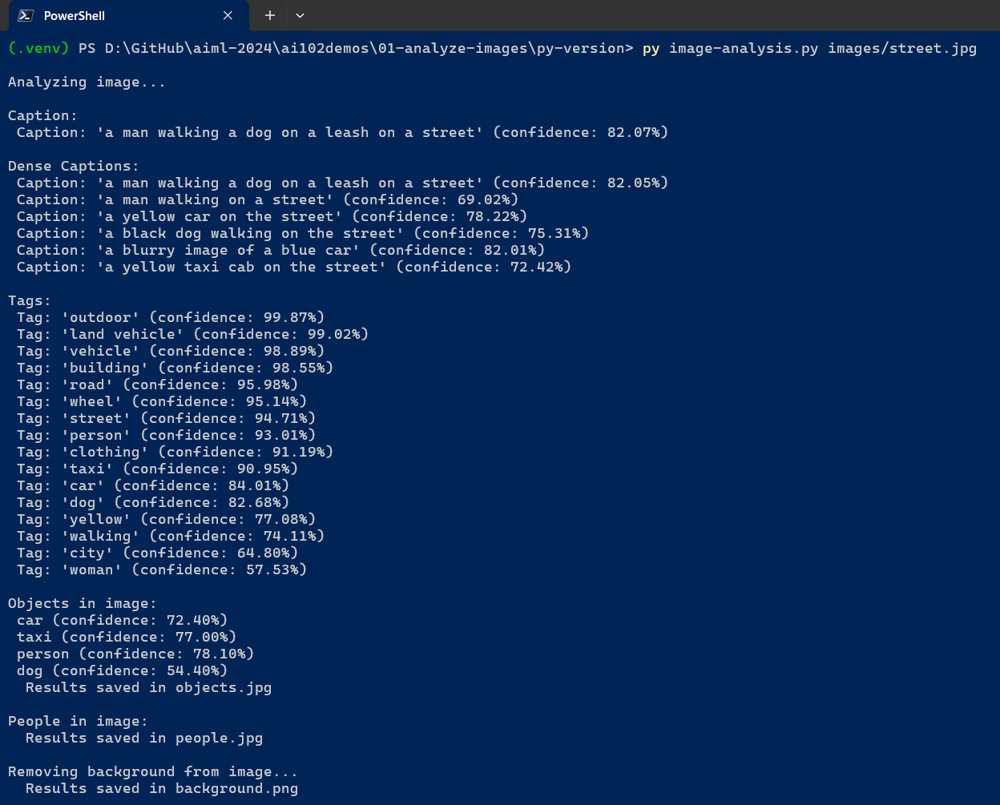

# AI 102 - Unlocking Insights with Azure AI Vision and Custom Vision in Python

## Date Time: 30-Jul-2024 at 05:00 PM IST

## Event URL: [https://www.meetup.com/microsoft-reactor-bengaluru/events/301458311](https://www.meetup.com/microsoft-reactor-bengaluru/events/301458311)

## YouTube URL: [https://www.youtube.com/watch?v=ioQnb3ExJsk](https://www.youtube.com/watch?v=ioQnb3ExJsk)

## MS Learn Module(s)

> 1. <https://aka.ms/AIVision-Service>
> 1. <https://aka.ms/AIVisionmodels>
> 1. <https://aka.ms/Analyzei-mages>


---

### Software/Tools

> 1. OS: Windows 10/11 x64
> 1. Python / .NET 8
> 1. Visual Studio 2022
> 1. Visual Studio Code

### Prior Knowledge

> 1. Programming knowledge in C# / Python
> 1. Microservices / Distributed applications
> 1. Azure / Azure Open AI

## Technology Stack

> 1. .NET 8, Python, Azure

## Information


## What are we doing today?

> 1. The Big Picture
>    - Pre-requisites
>    - Previous Session
>    - Current Architecture
> 1. Provision an Azure AI Services resource
>    - Retrieve the `Endpoint` and `key` from Portal
>    - Retrieve/Modify the `key` using PowerShell
> 1. Verifying the Vision Analysis using Azure Service and Postman
> 1. Understanding containers
>    - `Docker` installed Locally
> 1. Deploy Azure AI services as Local Docker containers
>    - Deploy and run a Vision container on Local Docker
>    - Verify Local Docker Container using `Browser`
>    - Verify Local Docker Container using `Postman`
>    - Regenerate the API Key and verify the docker container
> 1. Deploy Azure AI services containers on Azure Container Instance
>    - Create ACI resource, and host the AI Service container
>    - Verify Vision container on Azure Container Instance using `Browser`
>    - Verify Vision container on Azure Container Instance using `Postman`
> 1. Deploy Azure AI services containers on Azure Kubernetes Service
>    - Create Azure Kubernetes Service Cluster
>    - Deploy Vision Container inside AKS
>    - Verify Vision container inside Azure Kubernetes Cluster using `Browser`
>    - Verify Vision container on Azure Kubernetes Cluster using `Postman`
> 1. SUMMARY / RECAP / Q&A

### Please refer to the [**Source Code**](https://github.com/vishipayyallore/aiml-2024/tree/main/ai102demos) of today's session for more details

---


---

## 1. The Big Picture

> 1. Unlocking Insights with Azure AI Vision and Custom Vision in Python

### Pre-requisites

> 1. Azure Open AI, AI/ML
> 1. Python, C#, and .NET 8

### Previous Session

> 1. `Entire playlist` <https://www.youtube.com/playlist?list=PLmsFUfdnGr3wmIh-glyiMkhHS6byEuI59>

### Current Architecture

> 1. NA

## 2. Provision an Azure AI Services resource

> 1. Discussion and Demo
> 1. Azure AI services multi-service account
> 1. Resource Group name `rg-ai102-dev-001`
> 1. Azure AI Services name `azaisvc-ai102-dev-001`

### 2.1. Retrieve the `Endpoint` and `key` from Portal

> 1. Discussion and Demo
> 1. Please place these inside your `secrets.json` which is outside your source code location, OR `appsettings.json` which is placed inside `.gitignore`
> 1. Please create an `appsettings.example.json` for reference.
> 1. Please place these inside your `.env` file.
> 1. Please create an `example.env` for reference.
> 1. Environment Variables is also another option.

### 2.2. Retrieve/Modify the `key` using PowerShell

> 1. Discussion and Demo

```powershell
$rgname="rg-ai102-dev-001"
$aaisvs="aisvc-central-india-001"

az cognitiveservices account keys list --name $aaisvs --resource-group $rgname

az cognitiveservices account keys regenerate --name $aaisvs --resource-group $rgname --key-name key1
```

## 3. Analyze images

> 1. Discussion and Demo
> 1. <https://microsoftlearning.github.io/mslearn-ai-vision/Instructions/Exercises/01-analyze-images.html>

```powershell
python -m venv .venv
.\.venv\Scripts\activate

python.exe -m pip install --upgrade pip

pip install azure-ai-vision-imageanalysis==1.0.0b1
pip install python-dotenv
pip install Pillow
pip install matplotlib
py image-analysis.py images/street.jpg
```



## X. SUMMARY / RECAP / Q&A

> 1. SUMMARY / RECAP / Q&A
> 2. Any open queries, I will get back through meetup chat/twitter.

---
