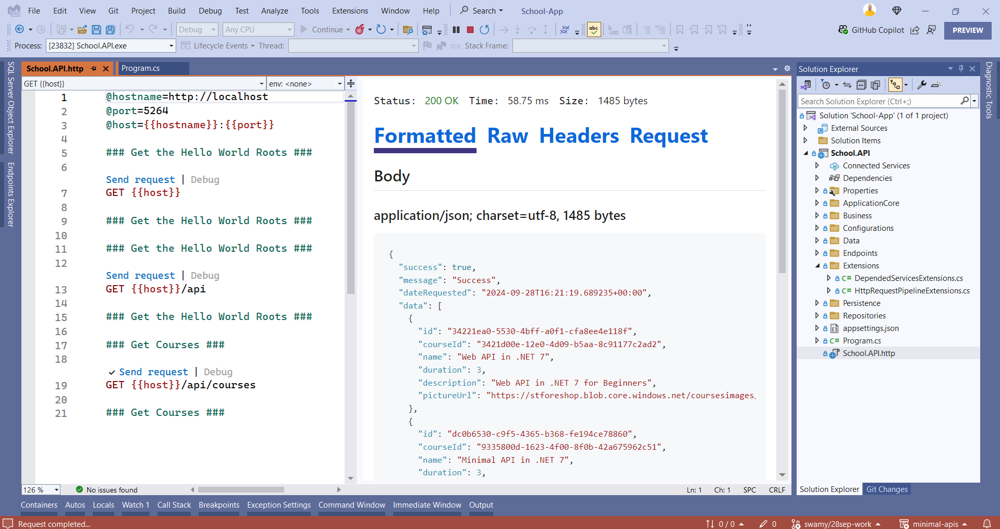
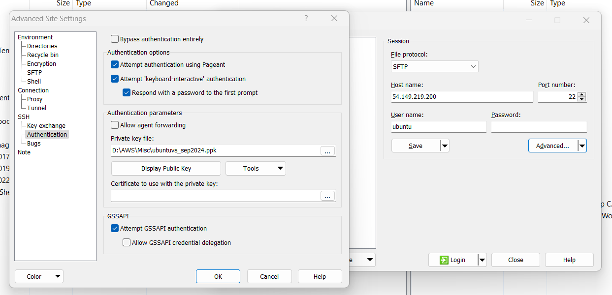
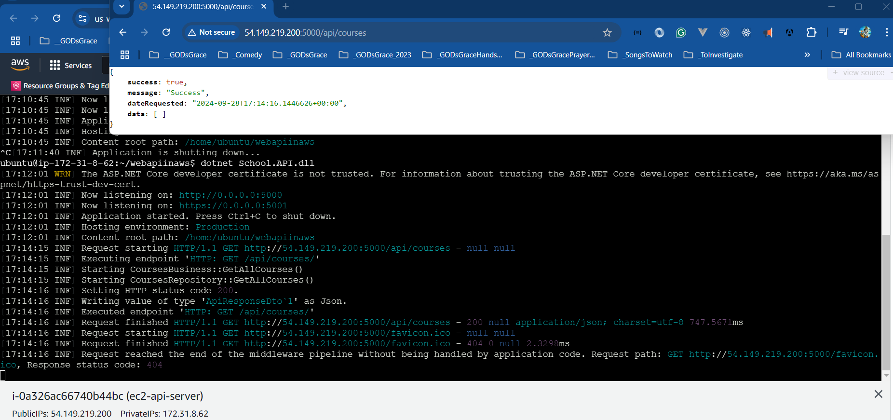

# AWS - Deploy .NET 8 Minimal API on Ubuntu EC2 Nginx

## Date Time: 29-Sep-2024 at 09:00 AM IST

## Event URL: [https://www.meetup.com/dot-net-learners-house-hyderabad/events/301436462](https://www.meetup.com/dot-net-learners-house-hyderabad/events/301436462)

## YouTube URL: [https://www.youtube.com/watch?v=DiTCaNKe-9k](https://www.youtube.com/watch?v=DiTCaNKe-9k)

<!--  -->

---

### Software/Tools

> 1. OS: Windows 10/11 x64
> 1. Python / .NET 8
> 1. Visual Studio 2022
> 1. Visual Studio Code

### Prior Knowledge

> 1. Programming knowledge in C#
> 1. Microservices / Distributed applications
> 1. AWS, CI/CD

## Technology Stack

> 1. .NET 8, C#, AWS, EC2, Nginx

## Information


## What are we doing today?

> 1. The Big Picture
> 1. SUMMARY / RECAP / Q&A

### Please refer to the [**Source Code**](https://github.com/ViswanathaSwamy-PK-TechSkillz-Academy/minimal-apis/tree/main/School) of today's session for more details

---


---

## 1. The Big Picture

> 1. Discussion

## Verifying the .NET 8 Web API on the local box

> 1. Discussion & Demo



## Create a New EC2

> 1. Discussion
> 1. Ubuntu 22.04


## Current Inbound Ports enables

> 1. Discussion
> 1. Port 22, 80 are enabled


## Installing Nginx on Ubuntu EC2

> 1. Discussion & Demo

```bash
sudo apt install net-tools
sudo apt-get -y update
sudo apt-get -y install nginx
curl -I http://localhost
```


## Installing .NET 8 on Ubuntu EC2

> 1. Discussion & Demo

### Reference(s)

> 1. <https://learn.microsoft.com/en-gb/dotnet/core/install/linux-ubuntu#2004->
> 1. <https://learn.microsoft.com/en-gb/dotnet/core/install/linux-ubuntu-install?pivots=os-linux-ubuntu-2204&tabs=dotnet8>

```bash
sudo apt-get update && \
  sudo apt-get install -y dotnet-sdk-8.0
```


## Publish the binaries into local folder

> 1. Discussion & Demo


## Push the binaries into the Ubuntu EC2

> 1. Discussion & Demo
> 1. Save the .pem to .ppk if you want to login using Putty.
> 1. Login into EC2 using WinSCP. Use WinSCP to convert PEM to PPK.
> 1. Push the binaries into Ubuntu EC2.





## Verify the .NET 8 Web API inside Ubuntu EC2

> 1. Discussion & Demo
> 1. Execute `dotnet --list-sdks`
> 1. Execute `dotnet School.API.dll`
> 1. Open another instance of the terminal and execute
> 1. `curl -I http://localhost:5000`
> 1. netstat -tnlp


## Verify the .NET 8 Web API outside Ubuntu EC2

> 1. Discussion & Demo
> 1. Update appsettings.json file with the `"urls": "http://0.0.0.0:5000;https://0.0.0.0:5001"`
> 1. `nano appsettings.json`, and `cat appsettings.json`
> 1. Please ensure port `5000`, and `5001` are added inside the Inbound Rules.
> 1. Execute `dotnet School.API.dll`
> 1. netstat -tnlp
> 1. Open the Web Browser and navigate to `http://PublicIP:5000`




## SUMMARY / RECAP / Q&A

> 1. SUMMARY / RECAP / Q&A

---
